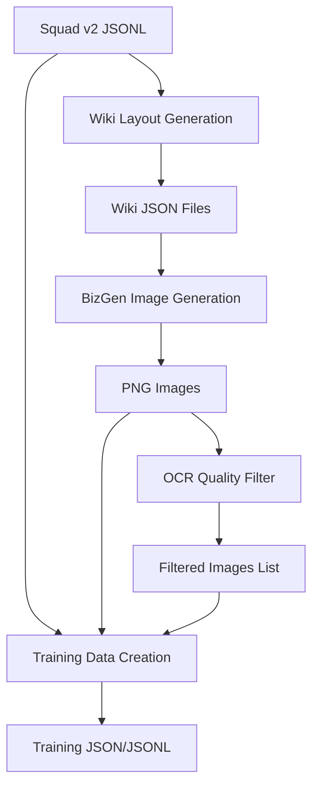

# VQA Pipeline Documentation

## Tổng quan Pipeline

Pipeline này tạo ra dữ liệu training cho Visual Question Answering (VQA) thông qua 4 bước chính:

1. **Wiki Layout Generation** - Tạo layout infographic từ dữ liệu Squad v2
2. **Image Generation** - Tạo hình ảnh từ layout bằng BizGen
3. **OCR Filtering** - Lọc hình ảnh chất lượng kém
4. **Training Data Creation** - Chuyển đổi thành format training

---

## 1. Wiki Layout Generation với BBox Matching

**File:** `src/data/narrator/generate_narrator_with_bbox.py`

### Mục đích
Tạo ra layout infographic 3-stage từ dữ liệu Squad v2 với hỗ trợ bbox matching.

### Input Parameters

| Parameter | Type | Default | Mô tả |
|-----------|------|---------|--------|
| `--model_name` | str | `unsloth/Qwen3-8B` | Tên model hoặc đường dẫn |
| `--input_data` | str | Squad v2 JSONL path | Đường dẫn file Squad v2 JSONL |
| `--stage_a` | str | Jinja template path | Template Stage 1 (content description) |
| `--stage_b` | str | Jinja template path | Template Stage 2 (layout planning) |
| `--stage_c` | str | Jinja template path | Template Stage 3 (bbox integration) |
| `--extracted_bboxes` | str | JSON path | File chứa extracted bboxes |
| `--output_dir` | str | Output directory | Thư mục output cho wiki files |
| `--start` | int | 1 | Chỉ số file bắt đầu (1-based) |
| `--end` | int | None | Chỉ số file kết thúc (exclusive) |
| `--num_samples` | int | None | Số samples xử lý (None = tất cả) |
| `--batch_size` | int | 8 | Batch size cho xử lý |
| `--temperature` | float | 0.7 | Temperature sampling |
| `--top_p` | float | 0.9 | Top-p sampling |
| `--max_tokens` | int | 8192 | Số token tối đa generate |
| `--gpu_memory_utilization` | float | 0.9 | Tỷ lệ sử dụng GPU memory |
| `--max_retries` | int | 2 | Số lần retry khi không tìm thầy keywords |

### Input Files

#### 1. Squad v2 JSONL File
```json
{
  "id": "56be4db0acb8001400a50202",
  "context": "Beyoncé Giselle Knowles-Carter (/biːˈjɒnseɪ/ bee-YON-say) (born September 4, 1981) is an American singer, songwriter and actress...",
  "question": "When did Beyonce start becoming popular?",
  "answers": {
    "text": ["in the late 1990s"],
    "answer_start": [269]
  },
  "is_impossible": false
}
```

#### 2. Jinja Templates
- **Stage A:** Content description template
- **Stage B:** Layout planning template  
- **Stage C:** BBox integration template

#### 3. Extracted BBoxes JSON
```json
{
  "bbox_id_1": {
    "x": 100,
    "y": 200,
    "width": 300,
    "height": 150,
    "type": "text"
  }
}
```

### Output Format

**File pattern:** `wiki{file_index:06d}.json`

```json
[
  {
    "infographic_id": 1,
    "context": "Original Squad v2 context...",
    "qa_pairs": [
      {
        "question": "When did Beyonce start becoming popular?",
        "answer": "in the late 1990s",
        "id": "56be4db0acb8001400a50202",
        "is_impossible": false
      }
    ],
    "stage_a_output": "Content description...",
    "stage_b_output": "Layout planning...",
    "stage_c_output": "Final infographic with bbox...",
    "final_infographic": "Complete infographic layout...",
    "bbox_assignments": {
      "bbox_1": "text content"
    },
    "keyword_check_passed": true,
    "processing_time": 12.5,
    "model_used": "unsloth/Qwen3-8B"
  }
]
```

### Xử lý thành công/thất bại
- **Thành công:** `keyword_check_passed: true`
- **Thất bại keywords:** `keyword_check_passed: false`
- **Lỗi xử lý:** `null` entry với error message

---

## 2. Image Generation với BizGen

**File:** `src/data/bizgen/inference.py`

### Mục đích
Tạo hình ảnh infographic từ wiki layout files sử dụng BizGen diffusion model.

### Input Parameters

| Parameter | Type | Default | Mô tả |
|-----------|------|---------|--------|
| `--wiki_dir` | str | Required | Thư mục chứa wiki JSON files |
| `--output_dir` | str | `output` | Thư mục output base |
| `--dataset_name` | str | `squad_v2` | Tên dataset cho cấu trúc thư mục |
| `--config_dir` | str | `config/bizgen_base.py` | File config BizGen |
| `--ckpt_dir` | str | `checkpoints/lora/infographic` | Thư mục checkpoint |
| `--device` | str | `cuda:0` | Device chạy inference |
| `--batch_size` | int | 4 | Batch size cho generation |
| `--seed` | int | 1234 | Random seed |
| `--global_ratio` | float | 0.2 | Global prompt effect ratio |
| `--num_inference_steps` | int | 50 | Số steps diffusion |
| `--guidance_scale` | int | 7 | Guidance scale |
| `--height` | int | 2240 | Chiều cao hình ảnh |
| `--width` | int | 896 | Chiều rộng hình ảnh |
| `--different_size` | bool | True | Sử dụng size khác nhau |
| `--lcfg_ratio` | float | 0.5 | LCFG timestep range |

### Input Format
Wiki JSON files từ step 1 với `final_infographic` field chứa layout description.

### Output Format
**Cấu trúc thư mục:**
```
output_dir/
├── dataset_name/
│   ├── 1.png
│   ├── 2.png
│   ├── 3.png
│   └── ...
```

**File naming:** `{infographic_id}.png`

---

## 3. OCR Quality Filtering

**File:** `src/data/ocr/ocr_filter.py`

### Mục đích
Lọc các hình ảnh có chất lượng OCR kém bằng cách so sánh Jaccard similarity giữa text trong JSON và OCR result.

### Input Parameters

| Parameter | Type | Default | Mô tả |
|-----------|------|---------|--------|
| `--images-dir` | str | Required | Thư mục chứa hình ảnh |
| `--bizgen-dir` | str | Required | Thư mục chứa wiki JSON files |
| `--output-dir` | str | Required | Thư mục output |
| `--threshold` | float | 0.5 | Ngưỡng Jaccard similarity |
| `--start-id` | int | 1 | Image ID bắt đầu |
| `--end-id` | int | None | Image ID kết thúc (auto-detect) |

### Xử lý Logic
1. **OCR Detection:** Sử dụng PaddleOCR để extract text từ hình ảnh
2. **Text Comparison:** So sánh với text trong wiki JSON bằng Jaccard similarity
3. **Filtering:** Hình ảnh có similarity < threshold sẽ bị lọc

### Output Format

**File:** `filtered_images.json`
```json
{
  "filtered_images": [
    {
      "image_id": 1,
      "image_path": "path/to/1.png",
      "jaccard_similarity": 0.35,
      "reason": "Low OCR similarity",
      "expected_text_words": 25,
      "ocr_text_words": 12,
      "common_words": 8
    }
  ],
  "summary": {
    "total_images_processed": 100,
    "images_filtered": 15,
    "images_passed": 85,
    "filter_rate": 0.15,
    "threshold_used": 0.5
  }
}
```

---

## 4. Training Data Creation

**File:** `src/data/narrator/convert_to_training_format.py`

### Mục đích
Chuyển đổi hình ảnh và QA data thành format training cho Qwen2-VL.

### Input Parameters

| Parameter | Type | Required | Mô tả |
|-----------|------|----------|--------|
| `--qa-file` | str | ✓ | Path tới QA data file (JSONL) |
| `--image-base-dir` | str | - | Base directory chứa images |
| `--dataset-name` | str | ✓ | Tên dataset (subfolder) |
| `--dataset-type` | str | ✓ | Loại dataset (squad_v2, narrativeqa, etc.) |
| `--output-file` | str | ✓ | Output JSON file path |
| `--output-jsonl-file` | str | - | Output JSONL file (auto-generated) |
| `--max-samples` | int | - | Số samples tối đa |
| `--seed` | int | 42 | Random seed |
| `--image-extensions` | list | png,jpg,jpeg | Extensions hình ảnh hỗ trợ |

### Input Format

#### Squad v2 JSONL
```json
{
  "id": "56be4db0acb8001400a50202",
  "context": "Context text...",
  "question": "Question text?",
  "answers": {"text": ["answer"], "answer_start": [100]},
  "is_impossible": false
}
```

#### Image Structure
```
image-base-dir/
├── dataset-name/
│   ├── 1.png
│   ├── 2.png
│   └── ...
```

### Output Format

#### JSON Format
```json
[
  {
    "id": "squad_v2_1_qa_1",
    "image": "relative/path/to/1.png",
    "conversations": [
      {
        "from": "human",
        "value": "<image>\nWhen did Beyonce start becoming popular?"
      },
      {
        "from": "gpt", 
        "value": "in the late 1990s"
      }
    ]
  }
]
```

#### JSONL Format
Mỗi dòng là một JSON object như trên.

### Data Mapping Logic
1. **Deduplication:** Loại bỏ context trùng lặp từ Squad v2
2. **Image Matching:** Tìm hình ảnh tương ứng với infographic_id
3. **QA Conversion:** Chuyển đổi QA pairs thành conversation format
4. **Path Resolution:** Tạo relative paths cho hình ảnh

---

## Workflow Tổng Thể



### File Flow
1. **Input:** Squad v2 JSONL → Wiki JSON files (chunked)
2. **Generation:** Wiki JSON → PNG images (numbered by infographic_id)
3. **Quality Control:** PNG images → Filtered list JSON
4. **Training Data:** Squad v2 JSONL + PNG images → Training JSON/JSONL

### Error Handling
- **Wiki Generation:** Failed samples saved as `null` với error message
- **Image Generation:** Logs errors, continues với remaining samples
- **OCR Filter:** Skips problematic images, logs warnings
- **Training Creation:** Skips missing images, reports statistics

---

## Cấu hình Environment

### Conda Environments
- **Wiki Generation:** `thinh_wiki` (có Qwen3, transformers)
- **Image Generation:** `bizgen` (có BizGen dependencies)

### GPU Requirements
- **Wiki Generation:** 1 GPU, ~20GB VRAM (Qwen3-8B)
- **Image Generation:** 1 GPU, ~12GB VRAM (Diffusion model)
- **OCR + Training:** CPU/GPU minimal

### Thời gian ước tính
- **Wiki Generation:** ~2-3 samples/minute
- **Image Generation:** ~4-8 images/minute (batch=4)
- **OCR Filter:** ~10-20 images/minute
- **Training Creation:** ~100+ samples/minute

---

## Troubleshooting

### Common Issues

1. **CUDA Out of Memory**
   - Giảm `batch_size`
   - Giảm `gpu_memory_utilization`
   - Giảm `max_tokens`

2. **Template Rendering Errors**
   - Kiểm tra Jinja template syntax
   - Verify template variables exist in context

3. **Missing Images**
   - Check image generation completion
   - Verify file naming consistency (infographic_id.png)

4. **OCR Filter Errors**
   - Install PaddleOCR dependencies
   - Check image format compatibility

5. **Training Data Mismatch**
   - Verify image paths exist
   - Check dataset-name folder structure
   - Confirm QA data format consistency

### Debug Commands

```bash
# Check wiki generation output
ls -la test_wiki_single/wiki*.json
python3 -c "import json; print(len(json.load(open('test_wiki_single/wiki000001.json'))))"

# Check image generation
ls -la src/data/bizgen/output/test_single/*.png
file src/data/bizgen/output/test_single/1.png

# Check OCR results
cat ocr_results_single/filtered_images.json | jq '.summary'

# Check training data
python3 -c "import json; data=json.load(open('training_data/test_single_training.json')); print(f'Samples: {len(data)}')"
```