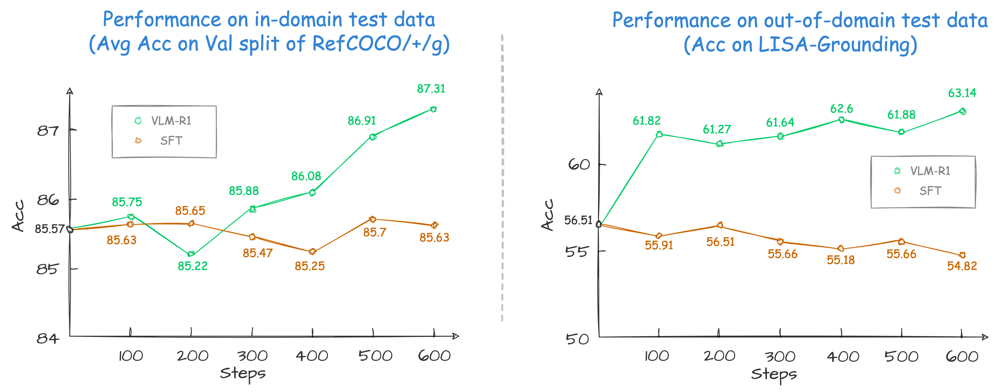

# VLM-R1: A stable and generalizable R1-style Large Vision-Language Model

<font size=4><div align='center' > [[🤗 REC Demo](https://huggingface.co/spaces/omlab/VLM-R1-Referral-Expression)] [[🤗 OVD Demo](https://huggingface.co/spaces/omlab/VLM-R1-OVD)] [[🤗 REC Data](https://huggingface.co/datasets/omlab/VLM-R1)] [[🤗 Checkpoints](https://huggingface.co/collections/omlab/vlm-r1-models-67b7352db15c19d57157c348)] </div></font>

<font size=4><div align='center'>[[📄 Tech Report](https://arxiv.org/abs/2504.07615)] [[📝 Blog](https://om-ai-lab.github.io/index.html)]</div></font>

<div align="center">

<div>
  <font size=4>
    <p>🎉  <b>Our VLM-R1 Math model reaches the top of the Open-Compass Math Leaderboard (under 4B parameters) and OVD model achieves the state-of-the-art performance on OVDEval.</b></p>
  </font>
</div>
</div>

Since the introduction of [Deepseek-R1](https://github.com/deepseek-ai/DeepSeek-R1), numerous works have emerged focusing on reproducing and improving upon it. In this project, we propose VLM-R1, a stable and generalizable R1-style Large Vision-Language Model.

Specifically, for the task of Referring Expression Comprehension (REC), we trained [Qwen2.5-VL](https://github.com/QwenLM/Qwen2.5-VL) using both R1 and SFT approaches. The results reveal that, on the in-domain test data, the performance of the SFT model shows little change compared to that of the R1 model base model when the number of training steps is relatively small (100–600 steps), while the R1 model shows a steady improvement (as shown at the left of the figure below). More importantly, on the out-of-domain test data, the SFT model's performance deteriorates slightly as the number of steps increases. Nevertheless, the RL model generalizes its reasoning ability to the out-of-domain data (as shown at the right of the figure below).


\* *We found previous REC SFT exps used a mismatch pixel config. Therefore, we re-run the study with the correct config on a more complex out-of-domain data. See our [findings](https://om-ai-lab.github.io/2025_03_24.html) for details.*

## 🚀 Features

This repository supports:

- **`Full Fine-tuning for GRPO`**: see [run_grpo_rec.sh](run_scripts/run_grpo_rec.sh)
- **`Freeze Vision Modules`**: set `freeze_vision_modules` as `true` in the script.
- **`LoRA Fine-tuning for GRPO`**: see [run_grpo_rec_lora.sh](run_scripts/run_grpo_rec_lora.sh)
- **`Multi-node Training`**: see [multinode_training_demo.sh](run_scripts/multinode_training_demo.sh)
- **`Multi-image Input Training`**: see [run_grpo_gui.sh](run_scripts/run_grpo_gui.sh)
- **`For your own data`**: see [here](#for-your-own-data)
- **`Various VLMs`**: see [How to add a new model](assets/add_new_model.md), now we support QwenVL and InternVL

## 🗞️ Update

- **`2025-08-29`**: 🔥🔥🔥 We have further optimized the VLM-R1 series models based on JD's latest open-source inference framework `xllm` (github is [here](https://github.com/jd-opensource/xllm)). The TTFT (Time to First Token) has been reduced by 50% compared to `vllm-ascend`, and the overall throughput has increased by 127% compared to `vllm-ascend`. Please refer to [ascend_inference/910B/xllm/README.md](ascend_inference/910B/xllm/README.md) for more details.

- **`2025-08-22`**: We have adapted the VLM-R1 series models to Huawei Ascend Atlas 800T A2 and Atlas 300I Duo series using the vllm-ascend framework, further expanding the deployment scenarios and hardware compatibility of the model series. Please refer to [ascend_inference/910B/vllm_ascend/README.md](ascend_inference/910B/vllm_ascend/README.md) and [ascend_inference/300IDuo/README.md](ascend_inference/300IDuo/README.md) for more details.

- **`2025-06-26`**: We introduce a post-resize operation for the bounding box for QwenVL (both [training](src/open-r1-multimodal/src/open_r1/vlm_modules/qwen_module.py#L124-L129) and [evaluation](src/eval/test_rec_r1.py#L92-L97)) and the results are improved slightly.
- **`2025-04-16`**: We have updated the codebase to improve functionality and maintain unified implementation. Specifically, the REC process is now integrated into [grpo_jsonl.py](src/open-r1-multimodal/src/open_r1/grpo_jsonl.py) for consistency across tasks. Additionally, we introduce a new parameter, `is_reward_customized_from_vlm_module`, which enables the use of customized reward functions defined within the VLM module. When set to `true`, the reward logic is handled in either [QwenVL2Module](src/open-r1-multimodal/src/open_r1/vlm_modules/qwen_module.py) or [InternVLModule](src/open-r1-multimodal/src/open_r1/vlm_modules/internvl_module.py), depending on the selected model. Furthermore, the training log has been enhanced to provide more detailed output for easier monitoring and debugging.
- **`2025-04-11`**: 🔥🔥🔥 We release the [technical report](https://arxiv.org/abs/2504.07615) of VLM-R1, summarizing our main results and insights.
- **`2025-04-03`**: We add the `odLength`, `weighted_sum`, and `cosine` reward used in OVD task, please refer our [blog post](https://om-ai-lab.github.io/2025_03_20.html) and [findings](https://om-ai-lab.github.io/2025_03_24.html) to the details of the reward usage and see [grpo_jsonl.py](src/open-r1-multimodal/src/open_r1/grpo_jsonl.py) for code implementation.
- **`2025-03-24`**: 🔥 We release the [findings](https://om-ai-lab.github.io/2025_03_24.html) of VLM-R1-OVD.
- **`2025-03-23`**: 🔥 We release the VLM-R1-OVD [model weights](https://huggingface.co/omlab/VLM-R1-Qwen2.5VL-3B-OVD-0321) and [demo](https://huggingface.co/spaces/omlab/VLM-R1-OVD), which shows the state-of-the-art performance on OVDEval. Welcome to use it.
- **`2025-03-20`**: 🔥 We achieved SOTA results on [OVDEval](https://github.com/om-ai-lab/OVDEval) with our RL-based model, outperforming SFT baselines and specialized object detection models. Read our [blog post](https://om-ai-lab.github.io/2025_03_20.html) for details on how reinforcement learning enhances object detection performance.
- **`2025-03-17`**: Our VLM-R1 Math model reaches the top of the [Open-Compass Math Leaderboard](https://rank.opencompass.org.cn/leaderboard-multimodal-reasoning/?m=REALTIME) (under 4B parameters). We have released the [checkpoint](https://huggingface.co/omlab/VLM-R1-Qwen2.5VL-3B-Math-0305).
- **`2025-03-15`**: We support multi-image input data. Check the format of multi-image input [here](#for-your-own-data). We also provide an example of multi-image script [run_grpo_gui.sh](run_scripts/run_grpo_gui.sh), see [here](#for-your-own-data) for details.
- **`2025-03-13`**: We support InternVL for GRPO. See [run_grpo_rec_internvl.sh](run_scripts/run_grpo_rec_internvl.sh) for details. The annotation json files used in InternVL are [here](https://huggingface.co/datasets/omlab/VLM-R1/resolve/main/rec_jsons_internvl.zip). If you want to add your new model, please refer to [How to add a new model](assets/add_new_model.md).
- **`2025-03-02`**: We support LoRA Fine-tuning for GRPO. See [run_grpo_rec_lora.sh](run_scripts/run_grpo_rec_lora.sh) for details.
- **`2025-02-27`**: We support the `number of iterations per batch` and `epsilon value for clipping` in the original GRPO algorithm with args: `--num_iterations` and `--epsilon`.
- **`2025-02-25`**: We support multi-node training for GRPO. See [multinode_training_demo.sh](run_scripts/multinode_training_demo.sh) for details.
- **`2025-02-21`**: We release the [checkpoint](https://huggingface.co/omlab/Qwen2.5VL-3B-VLM-R1-REC-500steps) of the VLM-R1 REC model.
- **`2025-02-20`**: We release the script for [general data loading](#for-your-own-data).
- **`2025-02-19`**: We incorporate an explanation of the [SFT](#sft) method.
- **`2025-02-17`**: We release the VLM-R1 REC [Demo](https://huggingface.co/spaces/omlab/VLM-R1-Referral-Expression) on Hugging Face Spaces.
- **`2025-02-15`**: We release the VLM-R1 repository and [GRPO](#grpo) training script.

## 🤖 Models

- **[`OVD`](https://huggingface.co/omlab/VLM-R1-Qwen2.5VL-3B-OVD-0321)**: Trained with VLM-R1, our Open-Vocabulary Detection (OVD) model achieves the state-of-the-art performance on OVDEval.
- **[`Math`](https://huggingface.co/omlab/VLM-R1-Qwen2.5VL-3B-Math-0305)**: Through VLM-R1 training, our math model focuses on multimodal reasoning tasks and has achieved Top1 on the OpenCompass Multi-modal Reasoning Leaderboard among models < 4B.
- **[`REC`](https://huggingface.co/omlab/Qwen2.5VL-3B-VLM-R1-REC-500steps)**: Trained with VLM-R1, our Referring Expression Comprehension (REC) model showcases the superior performance on out-of-domain data and a series of reasoning-grounding tasks.
- **[`GUI`](https://huggingface.co/konkazzz/GT-r1)**: Trained with VLM-R1, our GUI Defect Detection model outperforms both base and SFT models by achieving the best accuracy and improved generalization across both defective and clean screens.

| Version                          | Base VLM     | Checkpoint                                                                                           | Task Type                 |
| -------------------------------- | ------------ | ---------------------------------------------------------------------------------------------------- | ------------------------- |
| VLM-R1-Qwen2.5VL-3B-OVD-0321     | Qwen2.5VL-3B | [omlab/VLM-R1-Qwen2.5VL-3B-OVD-0321](https://huggingface.co/omlab/VLM-R1-Qwen2.5VL-3B-OVD-0321)         | Open-Vocabulary Detection |
| VLM-R1-Qwen2.5VL-3B-Math-0305    | Qwen2.5VL-3B | [omlab/VLM-R1-Qwen2.5VL-3B-Math-0305](https://huggingface.co/omlab/VLM-R1-Qwen2.5VL-3B-Math-0305)       | Multi-Modal Math          |
| VLM-R1-Qwen2.5VL-3B-REC-500steps | Qwen2.5VL-3B | [omlab/Qwen2.5VL-3B-VLM-R1-REC-500steps](https://huggingface.co/omlab/Qwen2.5VL-3B-VLM-R1-REC-500steps) | REC/Reasoning-Grounding   |

## 🎯 ToDo

- [X] Implement multi-node training.
- [X] Implement LoRA Fine-tuning.
- [X] Support more Multimodal LLMs.
- [X] Support multi-image input.
- [X] Release the VLM-R1 Math model.
- [X] Release the blog of VLM-R1.
- [X] Release the VLM-R1-OVD model.
- [X] Release the technical report of VLM-R1.
- [X] Adapt to Huawei Ascend Atlas 800T A2 and Atlas 300I Duo series using the vllm-ascend framework.
- [X] Adapt to Huawei Ascend Atlas 800T A2 series using the xllm framework.
- [ ] Study cross task generalization.
- [ ] Enhance VLM for other tasks [welcome issue].

## 🛠️ Setup

```bash
conda create -n vlm-r1 python=3.10
conda activate vlm-r1
bash setup.sh
```

## 💪🏻 Training

### Referring Expression Comprehension (REC)

#### 📚 GRPO

1. Download the [COCO Train2014 image](https://huggingface.co/datasets/omlab/VLM-R1/resolve/main/train2014.zip) and unzip it, and we refer to the image dir as `<your_image_root>`.
2. Download the [RefCOCO/+/g and LISA-Grounding Annotation files](https://huggingface.co/datasets/omlab/VLM-R1/resolve/main/rec_jsons_processed.zip) and unzip it (LISA-Grounding is used for out-of-domain evaluation).
3. Change the `data_paths` and `image_folders` in the [run_scripts/run_grpo_rec.sh](run_scripts/run_grpo_rec.sh) file.

```bash
# These jsonl files are included in the annotation files at step 2.
# Note: please use jsonl files instead of json files.
data_paths="path/to/refcoco_train.jsonl:path/to/refcocop_train.jsonl:path/to/refcocog_train.jsonl"
image_folders="path/to/coco:path/to/coco:path/to/coco"
```

4. ``bash run_scripts/run_grpo_rec.sh``

> [!NOTE]
> If you encounter 'CUDA out of memory' error, you can try to reduce the `per_device_train_batch_size`.

<div align="center">

</div>
<!--  -->

#### 📚 Multi-Node GRPO

For multi-node training, please refers to [multinode_training_demo.sh](src/open-r1-multimodal/multinode_training_demo.sh).

#### 📚 SFT

We use [LLaMA-Factory](https://github.com/hiyouga/LLaMA-Factory) to train the SFT model.

1. Clone the [LLaMA-Factory](https://github.com/hiyouga/LLaMA-Factory) repository and install the dependencies.

```bash
git clone https://github.com/hiyouga/LLaMA-Factory.git
cd LLaMA-Factory
pip install -e ".[torch,metrics]"
```

2. Download the dataset_info.json, mllm_rec_json.json, and qwen2_5_vl_full_sft.yaml we provided [here](https://huggingface.co/datasets/omlab/VLM-R1/tree/main/sft_related). Put the json files in the `LLaMA-Factory/data` directory and the yaml file in the `LLaMA-Factory/examples/train_full` directory.
3. Run the following command to train the SFT model.

```bash
llamafactory-cli train examples/train_full/qwen2_5_vl_full_sft.yaml
```

### For your own data

<div style="text-align: justify;">

We support data loading the jsonl data of this format in [`src/open-r1-multimodal/src/open_r1/grpo_jsonl.py`](src/open-r1-multimodal/src/open_r1/grpo_jsonl.py). Please note that you may need to use different reward functions for your specialized tasks. Welcome to PR to add your own reward functions or share any other interesting findings!

</div>

The jsonl has the format as follows:

```json
{
  "id": 1,
  "image": "Clevr_CoGenT_TrainA_R1/data/images/CLEVR_trainA_000001_16885.png",
  "conversations": [
    {"from": "human", "value": "<image>What number of purple metallic balls are there?"},
    {"from": "gpt", "value": "0"}
  ]
}
```

If you want to use multi-image input, you can use the following format:

```json
{
  "id": 1,
  "image": ["Clevr_CoGenT_TrainA_R1/data/images/CLEVR_trainA_000001_16885.png", "Clevr_CoGenT_TrainA_R1/data/images/CLEVR_trainA_000001_16886.png"],
  "conversations": [
    {"from": "human", "value": "<image><image>What number of purple metallic balls in total within the two images?"},
    {"from": "gpt", "value": "3"}
  ]
}
```

> [!NOTE]
> The image path in the jsonl file should be relative to the image folder specified in `--image_folders`. The absolute path of the input image is constructed as `os.path.join(image_folder, data['image'])`. For example:

- If your jsonl has `"image": "folder1/image1.jpg"`
- And you specify `--image_folders "/path/to/images/"`
- The full image path will be `/path/to/images/folder1/image1.jpg`

Multiple data files and image folders can be specified using ":" as a separator:

```bash
--data_file_paths /path/to/data1.jsonl:/path/to/data2.jsonl \
--image_folders /path/to/images1/:/path/to/images2/
```

The script can be run like this:

```bash
# You could refer to the run_grpo_rec.sh for the example
torchrun --nproc_per_node="8" \
    --nnodes="1" \
    --node_rank="0" \
    --master_addr="127.0.0.1" \
    --master_port="12345" \
  src/open_r1/grpo_jsonl.py \
    --output_dir output/$RUN_NAME \
    --model_name_or_path Qwen/Qwen2.5-VL-3B-Instruct \
    --deepspeed ${REPO_HOME}/src/open-r1-multimodal/local_scripts/zero3.json \
    --data_file_paths /path/to/your/data.jsonl \ # can be multiple, separated by ":"
    --image_folders /path/to/your/image/folder \ # can be multiple, separated by ":"
    ...
```

<div style="text-align: justify;">

### Multi-image Input
We provide an example of multi-image script [run_grpo_gui.sh](src/open-r1-multimodal/run_scripts/run_grpo_gui.sh). This task requires the model to analyze two GUI screenshots, taken before and after a user action, to determine if any UI interaction defects are present, which is from [GUI-Testing-Arena](https://huggingface.co/datasets/songjah/GTArena-UI-Defects). Download the [image](https://huggingface.co/datasets/omlab/VLM-R1/resolve/main/gui_multi-image.zip) and unzip it into the `/path/to/images/`. Then modify the `image_folders` parameter in the script and run it.

```bash
bash run_scripts/run_grpo_gui.sh
```

</div>

## 📊 Evaluation


1. Download the provided [LISA-Grounding images](https://huggingface.co/datasets/omlab/VLM-R1/resolve/main/lisa-test.zip).

```bash
cd ./src/eval

# Remember to change the model path, image root, and annotation path in the script
torchrun --nproc_per_node=X test_rec_r1.py # for GRPO. 'X' is the number of GPUs you have.
torchrun --nproc_per_node=X test_rec_baseline.py # for SFT.
```

## 🔍 Ascend Inference

We have adapted the VLM-R1 series models to Huawei Ascend Atlas 800T A2 and Atlas 300I Duo series using the vllm-ascend framework. The specific adaptation and inference are as follows:

- **Atlas 800T A2**: Please refer to [ascend_inference/910B/vllm_ascend/README.md](ascend_inference/910B/vllm_ascend/README.md)
- **Atlas 300I Duo**: Please refer to [ascend_inference/300IDuo/README.md](ascend_inference/300IDuo/README.md)

## 🤝 Acknowledgements

We would like to express our sincere gratitude to [DeepSeek](https://github.com/deepseek-ai/DeepSeek-R1), [Open-R1](https://github.com/huggingface/open-r1), [QwenVL](https://github.com/QwenLM/Qwen2.5-VL), [Open-R1-Multimodal](https://github.com/EvolvingLMMs-Lab/open-r1-multimodal), [R1-V](https://github.com/Deep-Agent/R1-V), [RefCOCO](https://github.com/lichengunc/refer), [RefGTA](https://github.com/mikittt/easy-to-understand-REG/tree/master/pyutils/refer2), [LLaMA-Factory](https://github.com/hiyouga/LLaMA-Factory), [OVDEval](https://github.com/om-ai-lab/OVDEval), [GUI-Testing-Arena](https://huggingface.co/datasets/songjah/GTArena-UI-Defects), and [LISA](https://github.com/dvlab-research/LISA) for providing open-source resources that contributed to the development of this project.

## ⭐️ Citation

If you find this project useful, welcome to cite us.

```bib
@article{shen2025vlm,
  title={Vlm-r1: A stable and generalizable r1-style large vision-language model},
  author={Shen, Haozhan and Liu, Peng and Li, Jingcheng and Fang, Chunxin and Ma, Yibo and Liao, Jiajia and Shen, Qiaoli and Zhang, Zilun and Zhao, Kangjia and Zhang, Qianqian and Xu, Ruochen and Zhao, Tiancheng },
  journal={arXiv preprint arXiv:2504.07615},
  year={2025}
}
```
